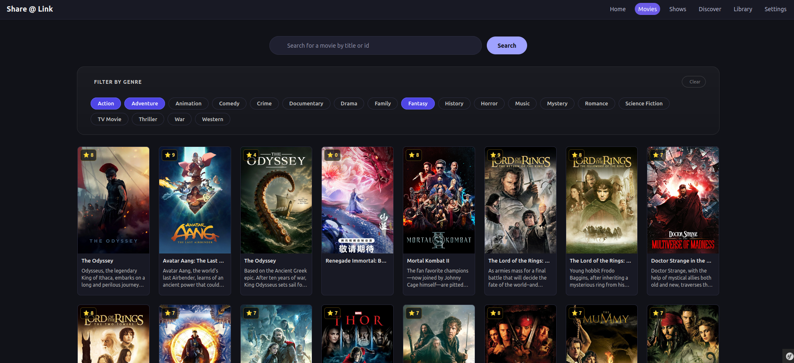
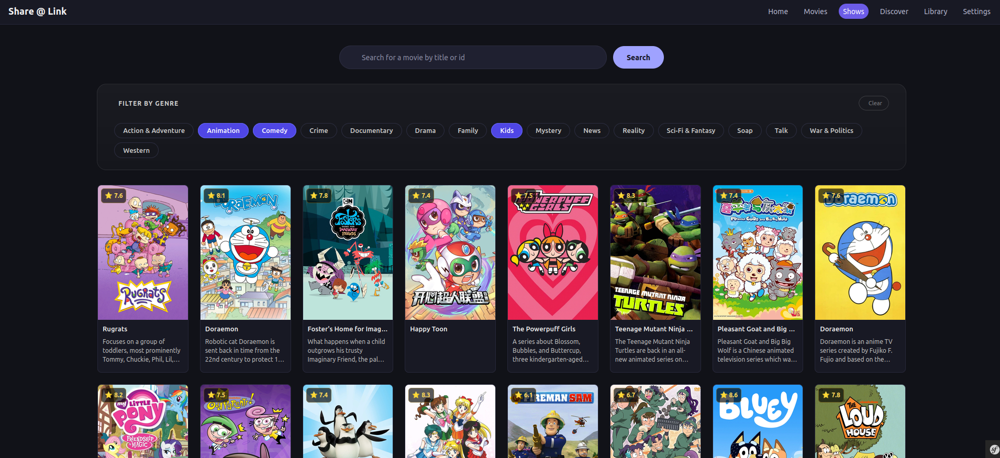
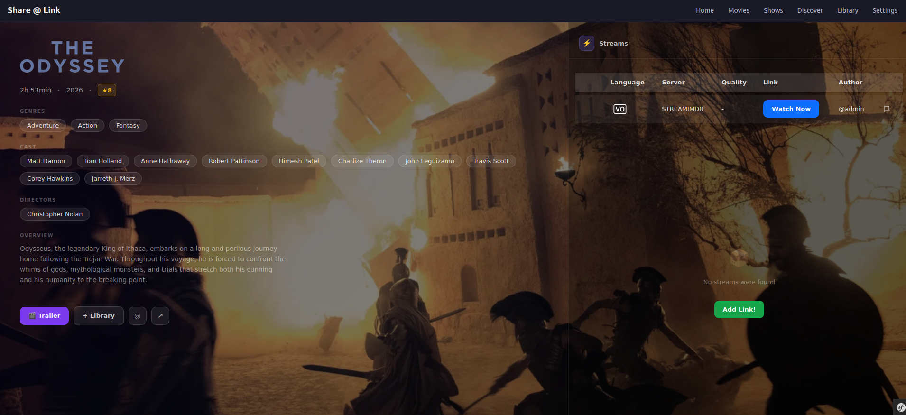
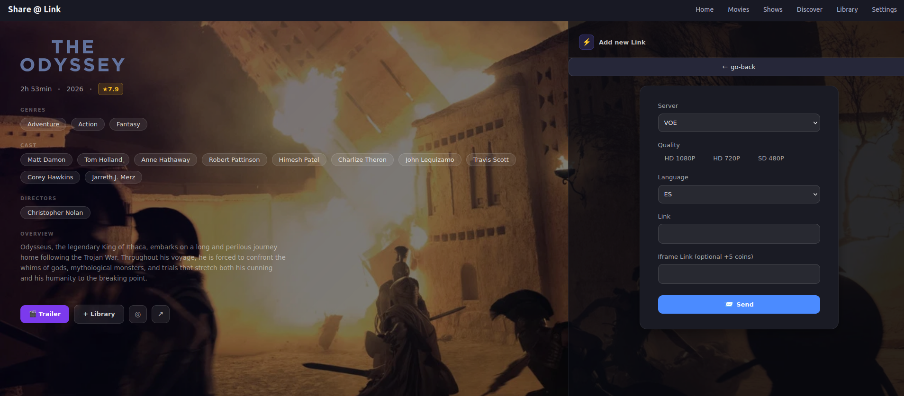
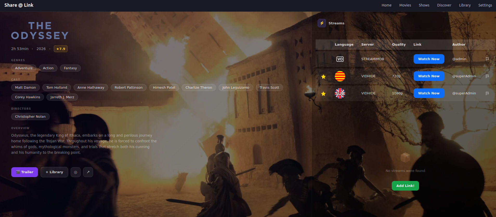

# ShareALink

> Media management and streaming application (movies and TV shows), with a backend built on hexagonal architecture and a frontend following SOLID principles. The entire stack spins up with a single command thanks to Docker Compose.

<!--
  💡 Suggestion: add a short GIF here (5-10s) showing the app's main flow:
  login → popular listing → movie/show detail → playback.
  Quick tools to record it: Peek (Linux), ScreenToGif (Windows), Kap (Mac).
  Upload it to the repo's /docs/media/ folder and link it like this:

  
-->


---

## 📋 Table of contents

- [What is ShareALink](#what-is-sharealink)
- [Architecture](#architecture)
- [Tech stack](#tech-stack)
- [Screenshots](#screenshots)
- [Prerequisites](#prerequisites)
- [Getting started](#getting-started)
- [Demo users](#demo-users)
- [Available commands (Makefile)](#available-commands-makefile)
- [Environment variables](#environment-variables)
- [Queues and async processing](#queues-and-async-processing)
- [Roadmap / future improvements](#roadmap--future-improvements)
- [License](#license)
- [Author](#author)

---

## What is ShareALink

ShareALink pulls its catalog of movies and TV shows from **The Movie Database (TMDB)**, so users can browse an always-up-to-date library without any manual content curation.

Once logged in, users can attach **streaming links** to any movie or show in the catalog — linking out to external streaming pages — and share those links with the rest of the community. In return, they can browse links that other users have already uploaded and watch content shared by them, directly from the platform.

The name reflects exactly that: **MediaBridge** (the backend) acts as the bridge to TMDB's data, while the frontend turns that data into a place where users **share a link** to whatever they're watching. This project was built as a portfolio piece to demonstrate a full-stack Dockerized setup with a hexagonal-architecture backend and a SOLID-oriented frontend, working together as two independently deployable services.

---

## Architecture

ShareALink is a **monorepo** made up of two independent Symfony applications that communicate over HTTP:

```
sharealink-app/
├── backend/    → MediaBridge (REST API, hexagonal architecture)
├── frontend/   → ShareALink UI (Symfony + Twig + Stimulus, SOLID principles)
└── compose.yaml → orchestrates the whole stack
```

```
                     ┌─────────────────────┐
                     │        User          │
                     └──────────┬───────────┘
                                │  HTTP (browser)
                     ┌──────────▼───────────┐
                     │   Frontend :8080      │
                     │  Symfony + Twig +     │
                     │  Stimulus (SOLID)     │
                     └──────────┬───────────┘
                                │  REST API (JWT auth)
                     ┌──────────▼───────────┐
                     │   Backend API :8081    │
                     │  MediaBridge           │
                     │  (hexagonal arch.)     │
                     └───┬─────────┬─────────┘
                         │         │
              ┌──────────▼──┐   ┌─▼──────────┐
              │   MariaDB    │   │   Redis     │
              └─────────────┘   └────────────┘
                         │
              ┌──────────▼──────────┐
              │  Messenger Worker    │
              │  (async queues)      │
              └──────────┬──────────┘
                         │
              ┌──────────▼──────────┐
              │      TMDB API         │
              └───────────────────────┘
```

The **backend (MediaBridge)** acts as a bridge between the application and external media data sources (TMDB), exposing a REST API documented with Swagger. The **frontend** consumes that API and renders the user interface — it does not access the database directly.

The system is built around two API boundaries:

- **Frontend ↔ Backend**: the frontend never touches the database directly. Every piece of data (catalog, links, users) is fetched from the backend's REST API, authenticated with JWT. This keeps the two applications fully decoupled — the backend could serve a mobile app or a different frontend without any changes.
- **Backend ↔ TMDB**: the backend acts as a bridge (hence *MediaBridge*) to TMDB's public API. Popular movies and shows are fetched and cached, with syncing offloaded to background workers via Symfony Messenger so that TMDB rate limits and latency never block a user-facing request.

---

## Tech stack

| Layer | Technology |
|---|---|
| Backend | PHP 8.2, Symfony, Doctrine ORM/Migrations, Symfony Messenger |
| Frontend | PHP 8.2, Symfony, Twig, Stimulus, Webpack Encore |
| Database | MariaDB 11 |
| Cache / locks | Redis 7 |
| Async queues | Symfony Messenger (Doctrine transport) |
| Authentication | JWT (LexikJWTAuthenticationBundle) |
| Queue monitoring | Zenstruck Messenger Monitor |
| API documentation | NelmioApiDocBundle (Swagger/OpenAPI) |
| Containers | Docker, Docker Compose |
| Web server | nginx + PHP-FPM (via supervisord) |

---

## Screenshots

### Popular

| Movies | Shows |
|---|---|
|  |  |

### Details

| Movie links | Login prompt | Add link |
|---|---|---|
|  |  |  |

### Stream
<!-- Pending -->

---

## Prerequisites

- [Docker](https://docs.docker.com/get-docker/) and [Docker Compose](https://docs.docker.com/compose/install/) (v2+)
- `make` (optional but recommended, simplifies every command)
- A [TMDB](https://www.themoviedb.org/settings/api) API key (free) for content sync

---

## Getting started

1. Clone the repository:
```bash
   git clone https://github.com/SpicyTacos23/sharealink-app.git
   cd sharealink-app
```

2. Copy the example environment file and fill in your own values (see [Environment variables](#environment-variables)):
```bash
   cp backend/.env.example backend/.env
```

3. Spin up the whole stack with a single command:
```bash
   make up
```
   or, without `make`:
```bash
   docker compose up --build
```

4. Access the application:
   - **Frontend**: [http://localhost:8080](http://localhost:8080)
   - **Backend API**: [http://localhost:8081](http://localhost:8081)
   - **API documentation**: [http://localhost:8081/api/doc](http://localhost:8081/api/doc)
   - **Queue panel**: [http://localhost:8081/admin/messenger](http://localhost:8081/admin/messenger)

---

## Demo users

Fixtures load three demo accounts so you can try the app without registering:

| User | Email | Password | Role |
|---|---|---|---|
| Admin | `admin.demo@local` | `adminDemo123` | `ROLE_ADMIN` |
| TestUser1 | `user1.demo@local` | `userDemo123` | `ROLE_USER` |
| TestUser2 | `user2.demo@local` | `userDemo456` | `ROLE_USER` |

---

## Available commands (Makefile)

| Command | Description |
|---|---|
| `make up` | Spins up the full stack (infra + backend + worker + frontend) |
| `make down` | Stops all containers |
| `make up-backend` | Spins up only infra + backend + worker |
| `make up-frontend` | Spins up only the frontend (requires backend already running) |
| `make check-connection` | Spins up backend and frontend, and verifies they can talk to each other |
| `make logs` | Shows logs for all services |
| `make logs-backend` / `logs-worker` / `logs-frontend` | Logs for a specific service |
| `make shell-backend` / `shell-worker` / `shell-frontend` | Opens a shell inside the container |
| `make migrations-diff` | Generates a new Doctrine migration from the entities |
| `make migrations-migrate` | Applies pending migrations |
| `make fixtures` | Loads sample data |
| `make reset-db` | Drops, recreates, and reseeds the database from scratch |

---

## Environment variables

Only two variables actually need to be filled in by you — everything else already has a working development default baked directly into `compose.yaml`.

| Variable | Required? | Description |
|---|---|---|
| `TMDB_API_KEY` | ✅ Yes | TMDB API key (v3 auth). Get it free at [themoviedb.org/settings/api](https://www.themoviedb.org/settings/api) after creating an account. |
| `TMDB_API_TOKEN` | ✅ Yes | TMDB API Read Access Token (v4 auth), from the same page. |
| `SENTRY_DSN` | ❌ Optional | Leave empty to disable error tracking. |

```bash
cp .env.example .env
# then edit .env and paste your TMDB credentials
```
Without `TMDB_API_KEY`/`TMDB_API_TOKEN` the backend will start correctly, but the catalog sync jobs will fail and no movies/shows will ever appear.

---

## Queues and async processing

The backend uses **Symfony Messenger** with a Doctrine transport to decouple heavy tasks (TMDB content sync) from HTTP requests. An independent **worker** container consumes messages from the queues:

- `async`: general events (e.g. page visit statistics)
- `tmdb_sync`: movie and show synchronization from TMDB
- `failed`: failed message queue, for manual inspection

Worker status and processed message history can be checked at `/admin/messenger` (via [Zenstruck Messenger Monitor](https://github.com/zenstruck/messenger-monitor-bundle)).

---

## Roadmap / future improvements

- [ ] Automated tests (unit / integration)
- [ ] CI/CD (GitHub Actions) for build and tests on every push
- [ ] Deployment to a publicly accessible cloud environment
- [ ] Search elements in local
- [ ] Create User
- [ ] Edit user settings
- [ ] Explore movies/Tvshows
- [ ] Add element to profile (save for later)
- [ ] Add local rating
- [ ] Create reward system for users uploading links
- [ ] Validate premium links with coin system (rewards)

---

## License

This project is licensed under the [MIT license](LICENSE).

---

## Author

Built by **SpicyTacos** — [GitHub](https://github.com/SpicyTacos23)